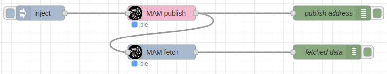

# node-red-contrib-iota

A group of nodes for IOTA (Tangle) integration with masked authenticated messaging (MAM) support.

# Installation

Run the following command in your Node-RED installation directory:
```
npm install node-red-contrib-iota
```

# Usage

**Currently, only MAM functionality is supported with the following nodes:**

- **MAM publish** (for publishing data to tangle)
- **MAM fetch** (for downloading data from tangle)

Drag MAM function node into a flow and wire it accordingly

## Example

An example flow based on the nodes is provided at "example/publish_fetch_example.json".



# Nodes

## MAM publish

Publishes the input message payload in JSON to a randomly generated address on the tangle network. Returns the message with the generated address in the payload.

## MAM fetch

Fetches the data from an address in the tangle network. The address is received from the input message payload. It returns the previously published messages in JSON from the address (number is defined by limit property) in the payload of the output message. The messages have timestamp in Unix epoch.

### Rate limits
on many public nodes you might have rate limits, so better use your own custom node connected to the tangle network, or make sure the node you connect to has the capacity to handle your required data traffic.
